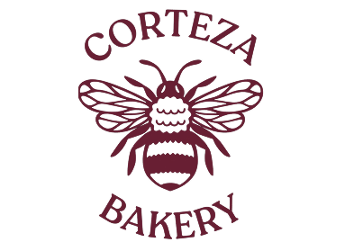

  

<h1 align="center">Corteza</h1>

<b>Sistema de Gestión Interna para Repostería</b>

---

## Descripción

Los encargados de producción en reposterías pequeñas no tienen visibilidad en tiempo real de cuánto insumo tienen, cuánto necesitan para un lote y cuándo deben reponer, lo que genera producción detenida por falta de insumos o compras innecesarias por exceso de stock.

**Corteza** centraliza inventario de insumos, recetas de producción y proveedores en un solo lugar, descontando automáticamente el stock cuando se completa un lote y alertando cuando un insumo baja del mínimo.

- **Usuario final:** encargado de inventario, jefe/panadero de producción, encargado de compras.
- **Utilidad:** reduce tiempo de control manual de inventario, disminuye mermas por insumos vencidos o mal calculados, y evita compras urgentes de última hora.

## Equipo

| Integrante | Rol |
|---|---|
| Jeisson Arboleda | Product Owner |
| Jesus Nuncira | Desarrollador Backend |
| Juan Lugo | Diseñador UI/UX |
| Sebastian Quintero | QA |
| Miguel Moreno | Desarrollador Frontend + Jira/GitHub |

## Arquitectura del sistema

Corteza se organiza en 3 épicas:

- **Gestión de Inventario** — registro de stock, alertas de reposición, historial de movimientos.
- **Gestión de Producción** — recetas, planificación de lotes, descuento automático de insumos.
- **Gestión de Proveedores y Compras** — registro de proveedores, órdenes de compra, recepción de pedidos.

## Requisitos no funcionales

| Categoría | Requisito |
|---|---|
| Rendimiento | Consultas de inventario en menos de 2 segundos |
| Seguridad | Autenticación y autorización por rol; contraseñas cifradas |
| Escalabilidad | El modelo de datos soporta crecimiento sin rediseño |
| Usabilidad | Interfaz clara para personal sin perfil técnico |
| Portabilidad | Accesible desde navegador, sin instalación local |
| Mantenibilidad | Código modular, documentado, trazable a commits vía Jira-GitHub |

## Tecnologías

| Categoría | Tecnología |
|---|---|
| Backend | .NET Core / C# |
| Frontend | Angular |
| Base de datos | SQL Server |
| Control de versiones | GitHub |
| Despliegue | Azure |
| Gestión de proyecto | Jira |
| IDE | Visual Studio |

## Identidad visual

| Color | Uso | Hex |
|---|---|---|
| 🟥 Rojo Corteza | Primario (logo, tipografía) | `#681F33` |
| ⬜ Crema | Fondo | `#F5EDE4` |
| 🟨 Dorado tostado | Acentos y alertas | `#C9A227` |

## Enlaces

- 📋 Proyecto en Jira: [SCRUM — corteza_bakery](https://morenoarenasmiguel.atlassian.net/jira/software/projects/SCRUM/summary)
- 💻 Repositorio: [github.com/09Miguel07/corteza-bakery](https://github.com/09Miguel07/corteza-bakery)

---

<i>Ingeniería de Software II · Universidad de Cundinamarca, Extensión Chía</i>

